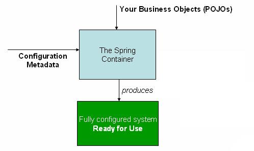
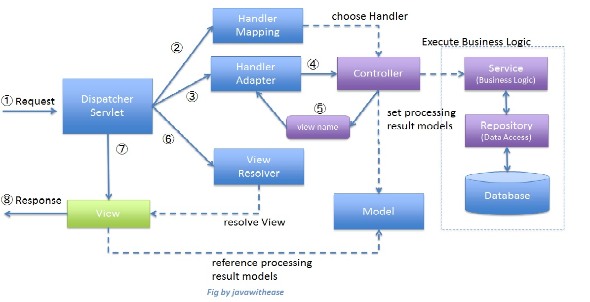

title: Spring IoC Containe
author:
  name: kevinjom
  twitter: kevinjom
  url: http://kevinjom.github.io
theme: jdan/cleaver-retro
controls: false
style: style.css
output: spring-ioc-basic.html

--

# Spring IoC Container

--

### Case

> We want to build an application which acts like a social media facade, when you want to post a message to your social media account, you just post to this app, it will post the message to your social accounts.

--

### Case
#### Components


--

### Case
#### Plain Old Java way

(demo)


--

### What is IoC

#### DI vs IoC
DI is a concret form of IoC

--

### Why is it

* flexibility
   - easy to change the implementation
* readability
   - simpler code
* testability
   - easy to test, because the dependencies are injected (created outside), so its easy to use stub or mocks.

--

### How (in Spring)



--

### IoC Containers
#### A colleciton of dependencies
- register dependencies
- dependency injection
- get dependencies

Spring provides

- BeanFactory
- ApplicationContext

--

### Congiuration metadata
#### configuration metadata represents how you as an application developer tell the Spring container to instantiate, configure, and assemble the objects in your application

Spring supports

- xml
- java configuration

--

###  Instantiating a container

(demo code)

--

### Use beans

(demo code)

--

### BeanFactory or ApplicationContext
#### ApplicationContext *please*
**ApplicationContext** can do all the things **BeanFactory** does, and also:

- Automatic BeanPostProcessor registration
- Automatic BeanFactoryPostProcessor registration
- Convenient MessageSource access (for i18n)
- ApplicationEvent publication

--


### DefaultListableBeanFactory
Currently,all the internal **ApplicationContext** use **DefaultListableBeanFactory** to as the bean container

--

###  Instantiating a bean
- constructor
- static fm
- instance fm
- FactoryBean

--

### Constructor Injection vs Setter Inection
#### follow Mr Jay, Constructor Injection *please*

(demo code)

--

### Bean Scope
- singleton(default)
- prototype
- request
- session
- global-session

--

### Bean Scope
> You cannot dependency-inject a prototype-scoped bean into your singleton bean, because that injection occurs only once

#### method injection?

--

### Autowire
>The Spring container can autowire relationships between collaborating beans

#### Autowiring modes
- no
- byType
- byName
- constructor

--

### @Autowired

- autowiring by type
- indicate this dependent bean is required
- BeanFactory supports? maybe *NOT*


@Resource - by name

--

### Component Scan
#### Instaed of configure beans by yourself, let spring find them and configure them for you

enable it by

```xml
    <context:component-scan base-package="com.github.kevinjom"/>
```

--

### What are they scanning?

- @Component
- @Service
- @Repositry
- @Controller
- @RestController

--

### Java Configuration
- @Configuration
- @Bean
- @Scope
- @ComponentScan

--

### Java Configuration

(demo)

--

### Lifecycle


--

### Lifecycle

- Bean lifecycle callbacks
- Aware interfaces
- Container extension points

--

### Bean lifecycle callbacks
- Init callbacks
- Desctruction callbacks

--

### Init callbacks
- PostConstruct
- InitializingBean
- custom init method

--

### Desctruction callbacks
- PreDestory
- DisposableBean
- custom destroy method

--

### Aware interfaces
- ApplicationContextAware
- ServletContextAware

--

### Container extension points
- BeanPostProcessor
- BeanFactoryPostProcessor

--

### BeanPostProcessor
```java
public interface BeanPostProcessor {
Object postProcessBeforeInitialization(Object bean,
		String beanName);

Object postProcessAfterInitialization(Object bean,
		String beanName)
}
```

--

### ApplicationContextAwareProcessor

```java
class ApplicationContextAwareProcessor
  implements BeanPostProcessor {
public Object postProcessBeforeInitialization(final Object bean, String beanName) throws BeansException {
		AccessControlContext acc = null;
      //...
			invokeAwareInterfaces(bean);
		//...
	}

		private void invokeAwareInterfaces(Object bean) {
		if (bean instanceof Aware) {
			//...
			if (bean instanceof ApplicationContextAware) {
				((ApplicationContextAware) bean)
				.setApplicationContext(this.applicationContext);
			}
		}
	}
```

--

### BeanFactoryPostProcessor
```java
public interface BeanFactoryPostProcessor {
void postProcessBeanFactory(ConfigurableListableBeanFactory
		beanFactory);
}
```

--

### WebApplicationContext
#### We are doing WEB things. YES!!!!

```java
public interface WebApplicationContext extends ApplicationContext {
ServletContext getServletContext();
}
```

--

### Spring MVC
#### offical


--

### Spring MVC
#### from someone I dont know but I like it

--

### Spring boot
#### Powered by Spring MVC

>you may have known `WebApplicationContext` and spring mvc, **NOW** lets
#### DIY a spring-boot app
(demo)

--

### Summary
- Spring has two types of IoC Containers
- We can config spring through XML and Java Config
- Use FactoryBean to instantiate a bean unless you cannot use constructor
- Constructor injection please

--

### Summary
- Don't dependency-inject a prototype-scoped bean into your singleton bean
- Use java config if you can, but don't hate XML
- Use lifecycle callbacks unless you cannot do it easily through other solution
- Spring mvc is the woman behind spring-boot, love it and understand it

--
# Thank you


